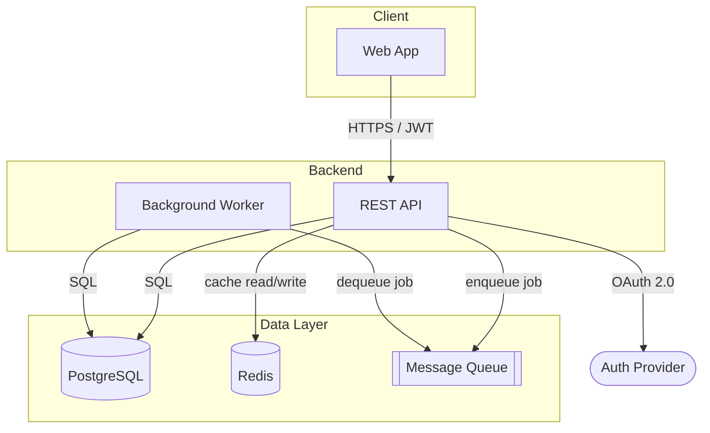

# Diagram Builder

This skill covers designing Mermaid diagrams and exporting them as both `.mmd` source and `.png` image files.

## Diagram Design

### Choosing the right diagram type

| Goal | Diagram type | Mermaid keyword |
|---|---|---|
| System components and data flow | Flowchart | `flowchart TD` |
| Request/response interactions | Sequence diagram | `sequenceDiagram` |
| State transitions | State diagram | `stateDiagram-v2` |
| Data entities and relationships | ER diagram | `erDiagram` |
| Timeline of events | Gantt | `gantt` |

### Flowchart design rules (most common)

Use `flowchart TD` (top-down) as the default for system and architecture diagrams.

**Nodes** — use shape to communicate role:
- `[Rectangle]` — service, component, module
- `(Rounded)` — start/end point, user, external system
- `[(Cylinder)]` — database, storage
- `[[Double bracket]]` — queue, buffer
- `{Diamond}` — decision point
- `([Stadium])` — external provider, third-party

**Edges** — label every arrow with what is being exchanged:
```
A -->|REST / JWT| B
A -->|SQL| DB
A -->|events| Queue
```

**Grouping** — use `subgraph` to cluster related components:
```
subgraph Backend
  API[REST API]
  Worker[Background Worker]
end
```

**Layout** — place user/client entry points at the top, data layer at the bottom.

### Example architecture diagram



## Export Process

### Step 1 — Write the `.mmd` source file

Write the Mermaid source to a `.mmd` file in the current working directory. Use a descriptive filename (e.g. `architecture-diagram.mmd`, `auth-flow.mmd`).

### Step 2 — Render to PNG

```bash
MMD_FILE="<filename>.mmd"
PNG_FILE="<filename>.png"

if command -v mmdc &> /dev/null; then
  mmdc -i "$MMD_FILE" -o "$PNG_FILE" -b white
elif command -v npx &> /dev/null; then
  npx --yes @mermaid-js/mermaid-cli mmdc -i "$MMD_FILE" -o "$PNG_FILE" -b white
else
  echo "Mermaid CLI not found. Install with: npm install -g @mermaid-js/mermaid-cli"
fi
```

### Step 3 — Confirm output

```bash
ls -lh "$MMD_FILE" "$PNG_FILE"
```

### Step 4 — Report to the user

- State the path to both exported files
- Inline the full Mermaid source in the response so the diagram is readable without opening any file
- If PNG rendering failed, tell the user exactly how to render it manually:
  ```bash
  npm install -g @mermaid-js/mermaid-cli
  mmdc -i <filename>.mmd -o <filename>.png -b white
  ```
